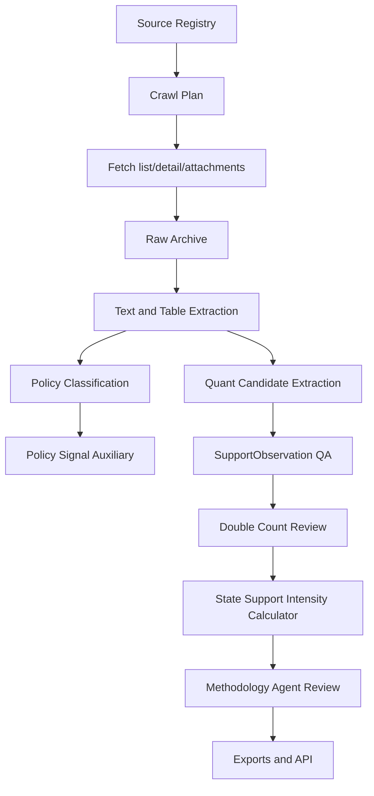

# 中国政策爬虫与多 Agent 设计

日期：2026-06-12

## 1. 设计原则

爬虫和 Agent 的职责必须服务于 PDF 一致的 `State Support Intensity Index`。

- 爬虫负责取得官方原文、附件、公告、统计和交易数据。
- 解析器负责形成可复盘的文档、正文、表格和字段候选。
- Agent 负责审查、解释和缺口管理。
- 最终指数只能由确定性代码基于 `SupportObservation` 计算。

`Policy Signal Index` 可以保留为辅助指标，用于发现政策热度和排序审查任务，但不能作为 V1 指数目标，也不能进入 SSI 金额聚合。

## 2. 爬虫来源

### 2.1 官方政策源

| Source ID | 入口 | 主要用途 |
|---|---|---|
| `gov_cn_policy` | `https://sousuo.www.gov.cn/zcwjk/` | 国务院和部门政策聚合 |
| `ndrc_policy` | `https://www.ndrc.gov.cn/xxgk/zcfb/` | 产业、投资、价格、能源政策 |
| `miit_policy` | `https://www.miit.gov.cn/zwgk/zcwj/index.html` | 工业、ICT、制造、汽车、通信 |
| `mof_policy` | `https://www.mof.gov.cn/zhengwuxinxi/zhengcefabu/` | 财政补贴、预算、税政、采购 |
| `chinatax_rules` | `https://fgk.chinatax.gov.cn/` | 税收优惠、R&D 加计扣除、退税 |
| `pbc_rules` | `https://www.pbc.gov.cn/tiaofasi/144941/3581332/index.html` | 信贷、金融支持、政策工具 |
| `landchina` | `https://www.landchina.com/` | 土地出让、供地结果、地价差 |

### 2.2 量化和 benchmark 源

| Source ID | 主要渠道 | V1 策略 |
|---|---|---|
| `oecd_data` | `r_and_d_tax_incentive`、`government_financed_berd` | 优先接入公开数据 |
| `exchange_filings` | `direct_subsidy`、`other_tax_incentive`、`soe_net_payables` | 抓取公开公告和定期报告 |
| `mof_budget_reports` | `direct_subsidy` | PDF/HTML 抽取预算和专项资金 |
| `pbc_stats` | `credit_subsidy` | 公开统计和政策工具公告 |
| `wind_csmar` | 多渠道企业级数据 | 未授权时仅保留 gap |
| `zero2ipo` | `guidance_fund` | 未授权时仅保留 gap |
| `wto_notifications` | benchmark | 低频批处理 |

## 3. 爬虫输出

每个 adapter 的输出必须至少包含：

```text
source_id
url
canonical_url
title
issuer
published_at
retrieved_at
raw_path
text_path
attachment_paths
content_hash
parse_status
source_document_ids
```

附件规则：

- HTML、PDF、Excel、Word、OFD 原件必须归档。
- 正文解析失败时保留原件，并标记 `parser_pending` 或 `parser_failed`。
- 禁止覆盖同 hash 文档；重复文档只增加来源映射。

## 4. SupportObservation 生成

爬虫不能直接写最终指数，但可以产生候选 observation。进入指数前必须通过 schema 和 QA。

候选 observation 字段：

```text
channel
industry
period
observed_amount
currency
normalization_base
normalization_base_type
directness_score
coverage_score
confidence_score
source_document_ids
double_count_group
estimation_method
gap_status
method_version
```

渠道映射规则：

- 政策文本只有金额、比例、额度、清单或统计字段时，才可生成 quantitative candidate。
- 只有方向性措辞时，只能生成 Policy Signal，不得生成 `observed_amount`。
- 授权源缺失时生成 `gap_status=missing`，并记录所需字段和来源。

## 5. 多 Agent 架构

V1 建议使用 6 个 Agent：

| Agent | 输入 | 输出 |
|---|---|---|
| `policy_nlp_analyst` | 文档正文、metadata | 政策类型、发文机关、政策工具审核 |
| `industry_mapping_analyst` | 文档、企业、项目、行业词典 | 行业和地区映射建议 |
| `channel_quant_analyst` | observation candidate | 渠道、金额、directness、coverage 审核 |
| `methodology_analyst` | 权重、基数、公式、去重日志 | PDF 一致性审查 |
| `evidence_qa_analyst` | 文档、observation、source ids | 证据缺口、低置信度、重复项 |
| `policy_red_team_reviewer` | snapshot、methodology | unsupported claim、伪量化、重复计算风险 |

Agent 输出统一 JSON envelope：

```json
{
  "agent_id": "methodology_analyst",
  "task_id": "task_001",
  "status": "completed",
  "findings": [],
  "recommended_actions": [],
  "blocked_by": [],
  "source_document_ids": [],
  "method_version": "ssi_v1"
}
```

## 6. Agent 约束

- Agent 不抓网页。
- Agent 不调用未授权数据源。
- Agent 不直接改 final index。
- Agent 不写 `/Users/alex/Documents/金融项目`。
- Agent 不把 Policy Signal 当作 SSI 金额输入。
- Agent 对缺失数据只能建议 `missing`、`estimated` 或 `proxy`，不能补造 observation。

## 7. 工作流



## 8. 验收标准

爬虫和 Agent 部分的 V1 验收标准：

- P0 官方源可以生成可追溯 `PolicyDocument`。
- quantitative 源可以生成或声明 `SupportObservation` / gap。
- 所有 observation 都包含 source document、method version 和 gap status。
- Agent 审查输出结构化 JSON，并可回链到文档和 observation。
- 任一 Agent 审查失败时，指数快照必须带 warning 或阻断发布。
- 当前金融项目只读消费，不参与爬取、解析、Agent 执行或指数计算。

## 9. 当前实现状态

截至 2026-06-12，已真实实现：

- `PolicyCrawler.crawl_public_source()`：从公开 HTML 列表发现详情页，保存 raw HTML、正文 text、metadata 和 content hash。
- `scripts/crawl_once.py`：默认执行真实公开源抓取，`--offline-sample` 只保留为开发 smoke。
- `SupportObservationExtractor`：从已抓取政策正文、分类结果和 `normalization_bases.yaml` 生成 `SupportObservation`；缺总金额或缺归一化基数时输出 `missing`。
- `OecdRDTaxBenchmarkClient`：通过 OECD SDMX CSV API 拉取中国 R&D tax support / government-financed BERD benchmark，存入 `workspace/observations/oecd_rdtax_berd_china.json`，不直接加入 SSI。
- `tests/test_real_pipeline.py`：覆盖公开 HTML 入库、金额抽取、缺基数 gap、额度上限不入 SSI、OECD benchmark 隔离。

当前未完成：

- MOF、NDRC、PBC 在本机联网 smoke 中返回 TLS EOF，需要网络环境修复、代理策略或站点专用抓取策略。
- LandChina 需要专用列表/交易页 parser。
- 交易所公告、Wind/CSMAR/Zero2IPO 等授权源 adapter 尚未接入。
