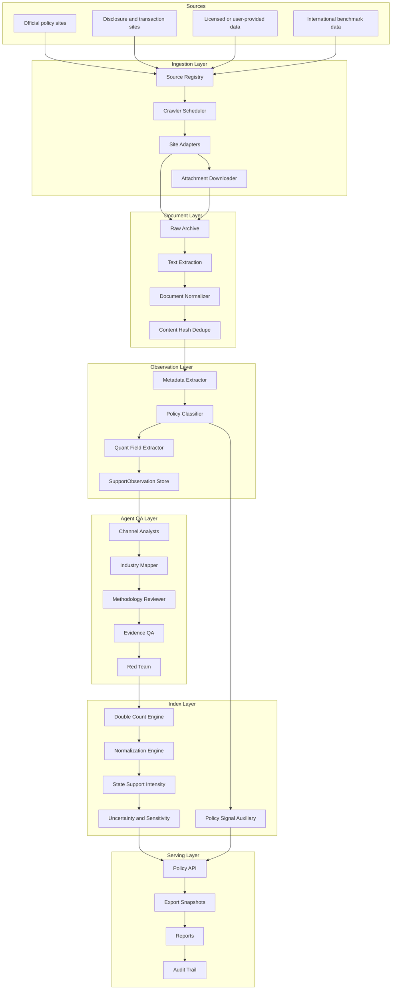

# China Policy Analyse 独立项目架构设计

日期：2026-06-12

## 1. 架构结论

`china policy analyse` 是独立的中国政策抓取、政策证据管理和国家支持强度指数项目。它不应被实现成单一政府官网爬虫，也不应让 Agent 临场上网搜索后直接写指数。

正确架构是：

```text
确定性数据工程底座
  + 政策文本证据链
  + PDF 一致的 SupportObservation
  + State Support Intensity 指数引擎
  + 多 Agent 审查和解释
  + 对金融项目只读输出
```

当前 `/Users/alex/Documents/金融项目` 只作为消费端，通过 HTTP API 或 `exports/latest/` 读取结果。政策项目拥有自己的 `.venv`、`.env`、workspace、logs、agent roster、cache 和 CAMEL runtime。

## 2. PDF 方法论对架构的约束

两份 PDF 定义的是完整 `China State Support Index`，不是政策热度榜。系统必须分三层处理：

| 层级 | 作用 | 产物 |
|---|---|---|
| 政策文本层 | 抓取官方政策、附件、解释和证据链 | `policy_documents`、`policy_classifications` |
| 可量化观察层 | 从政策、公告、统计、授权数据中形成金额或代理金额 | `support_observations` |
| 指数计算层 | 归一化、加权、去重、输出不确定性和 benchmark | `state_support_index_snapshot` |

`Policy Signal Index` 只能属于政策文本层的辅助产物，用于解释近期政策关注度、发现缺口和排序审查任务。它不能进入 SSI 金额公式。

## 3. 项目边界

独立政策项目负责：

- 官方政策源注册表和抓取调度。
- HTML、PDF、OFD、Excel 附件归档和正文抽取。
- 政策元数据、行业、渠道、可量化字段抽取。
- `SupportObservation` 存储和审计。
- `State Support Intensity` 指数计算。
- 双重计算控制、不确定性、benchmark 和方法版本。
- API、exports、报告和审计日志。

金融项目只负责：

- 读取政策项目 API 或 exports。
- 在行业、公司、Deal Copilot 或 Evidence Room 中引用政策结果。
- 不启动政策项目 CAMEL，不写政策 workspace，不共享 agent roster。

## 4. 总体架构



## 5. V1 支持渠道

V1 必须覆盖 PDF 口径的九类渠道：

| Channel ID | 名称 | 核心 observation |
|---|---|---|
| `direct_subsidy` | 直接财政补贴 | 企业/行业收到的政府补助、预算补贴、专项资金 |
| `r_and_d_tax_incentive` | R&D 税收优惠 | 研发费用加计扣除、R&D tax expenditure |
| `government_financed_berd` | 政府资助 BERD | OECD/NBS 口径政府资助企业研发 |
| `other_tax_incentive` | 其他税收优惠 | VAT、所得税、进口税、地方税费减免，扣除 R&D 部分 |
| `credit_subsidy` | 信贷补贴 / SOE 融资优势 | SOE-private 利差、政策贷款、贴息、担保等 |
| `guidance_fund` | 政府引导基金 | 政府出资或补贴等价，不按总基金规模全计 |
| `land_subsidy` | 土地和房地产补贴 | 市场价与实际成交价的差额 |
| `soe_net_payables` | SOE 净应付款优势 | 延迟付款形成的隐性融资支持 |
| `debt_equity_swap` | 债转股 | 债务成本下降或政府推动重组支持等价 |

## 6. Algorithm Contract

最小输入为 `SupportObservation`：

```text
channel
industry
period
observed_amount
currency
normalization_base
directness_score
coverage_score
confidence_score
source_document_ids
double_count_group
method_version
gap_status
```

默认公式：

```text
evidence_adjusted_amount =
  observed_amount
  * (1 + directness_score + coverage_score)
  * confidence_score

intensity[channel, industry, period] =
  evidence_adjusted_amount
  / normalization_base[industry, period]

SSI[industry, period] =
  100 * sum(channel_weight[channel] * intensity[channel, industry, period])

ChinaSSI[period] =
  sum(industry_weight[industry] * SSI[industry, period])
```

## 7. 双重计算控制

指数引擎必须在聚合前执行去重：

| 冲突 | 处理规则 |
|---|---|
| R&D 税收优惠 vs 其他税收优惠 | `other_tax_incentive` 中扣除 R&D 部分 |
| 政府资助 BERD vs 直接财政补贴 | 同一项目已进入 BERD 时，不再计入 direct subsidy |
| 引导基金 vs 直接补贴 | 只计政府资本或补贴等价，不计私人共同出资 |
| 土地优惠 vs 招商返还 | 同一地块或项目不能同时按返还和价差全额计入 |
| 信贷补贴 vs SOE payables | 都是融资支持，但机制不同；需单独披露并可做上限调整 |
| Policy Signal vs 金额指数 | Policy Signal 永不进入 SSI 金额聚合 |

## 8. Agent 架构

Agent 只做审查、解释和缺口管理，不直接写最终指数值。

| Agent | 职责 |
|---|---|
| `policy_nlp_analyst` | 审核政策元数据、政策工具、可量化字段 |
| `industry_mapping_analyst` | 审核行业、地区、主体映射 |
| `channel_quant_analyst` | 审核 observation 的渠道、金额和证据直达性 |
| `methodology_analyst` | 审核 PDF 公式、权重、归一化和去重规则 |
| `evidence_qa_analyst` | 标记低置信度、重复、缺字段和来源缺口 |
| `policy_red_team_reviewer` | 查找伪量化、重复计算和 unsupported claim |

约束：

- Agent 不临场抓网页。
- Agent 只读取已入库文档和 observation。
- Agent 输出结构化 JSON envelope。
- 最终指数由 deterministic calculator 生成。

## 9. API 和导出

V1 服务层至少提供：

```text
GET /api/index/state-support
GET /api/support-observations
GET /api/methodology
GET /api/index/policy-signal
GET /api/documents
GET /api/exports/latest
```

V1 导出：

```text
exports/latest/state_support_index_snapshot.json
exports/latest/support_observations.jsonl
exports/latest/methodology.json
exports/latest/policy_documents.jsonl
```

## 10. Implementation Roadmap

1. 文档纠偏：所有文档统一为 V1 SSI 口径。
2. 数据模型：新增 `SupportObservation`、权重、归一化基数、gap flags。
3. 数据接入：官方政策源作为证据链，OECD、MOF、税务、PBOC、LandChina、交易所公告作为 quantitative observation 来源。
4. 指数引擎：实现 SSI 公式、行业聚合、全国聚合、双重计算控制和区间输出。
5. QA/API/export：实现方法追踪、API、exports 和 agent 审查报告。
6. 稳健性：实现 sensitivity、benchmark warning 和方法版本回放。

## 11. 当前状态

当前项目是“骨架可运行，SSI 未实现”。`policy_signal` 快照可继续用于验证抓取和分类闭环，但不能作为 V1 指数验收。
