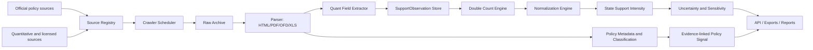

# 中国政策自动抓取与 State Support Intensity 系统设计

日期：2026-06-12

## 1. 设计结论

两份 PDF 的目标是构建可量化、可复盘的中国国家支持强度指数。V1 不再把“政策文本抓取 + Policy Signal”作为最终交付，而是直接围绕 `State Support Intensity Index` 建设。

系统必须同时回答三类问题：

1. 哪些官方政策、公告、统计和交易数据构成证据链？
2. 每个行业、渠道、期间的支持金额或代理金额是多少？
3. 这些 observation 如何归一化、加权、去重并形成 composite index？

政策文本仍然重要，但它是证据发现和解释层。真实指数必须来自结构化 `SupportObservation`。

## 2. PDF 核心内容拆解

PDF 采用 CSIS Red Ink / IMF 类方法，用多渠道衡量国家支持：

- 直接财政补贴。
- R&D 税收优惠。
- 政府资助 BERD。
- 其他税收优惠。
- 信贷补贴 / SOE 融资优势。
- 政府引导基金。
- 土地和房地产补贴。
- SOE 净应付款优势。
- 债转股。

行业维度至少覆盖：

- 制造业。
- ICT / 软件 / 通信。
- 能源。
- 汽车 / EV。
- 半导体。
- 生物医药。
- 金融。
- 建筑 / 房地产。
- 农业及农村产业。

PDF 的硬性方法论：

- 所有渠道先归一化到行业 GDP、产值、营收、资产、产能、产量或其他可解释基数。
- 公式必须体现 directness、coverage、confidence。
- R&D、BERD、税收、基金、土地、融资支持必须做双重计算控制。
- 缺失数据只能标记 gap 或 proxy，不能用政策热度伪造金额。
- 输出必须包含 sensitivity、uncertainty、benchmark warning 和方法版本。

## 3. 数据源分层

### 3.1 官方政策和证据源

| 来源 | 入口 | 用途 |
|---|---|---|
| 国务院政策文件库 | `https://sousuo.www.gov.cn/zcwjk/` | 国务院、国务院办公厅、部门文件聚合 |
| 发改委政策发布 | `https://www.ndrc.gov.cn/xxgk/zcfb/` | 产业、投资、价格、能源、创新政策 |
| 工信部政策文件 | `https://www.miit.gov.cn/zwgk/zcwj/index.html` | 工业、软件、集成电路、汽车、通信、制造业 |
| 财政部政策发布 | `https://www.mof.gov.cn/zhengwuxinxi/zhengcefabu/` | 预算、补贴、税收、政府采购、财政执行报告 |
| 税务总局政策法规库 | `https://fgk.chinatax.gov.cn/` | 税收优惠、公告、政策依据 |
| 人民银行规范性文件 | `https://www.pbc.gov.cn/tiaofasi/144941/3581332/index.html` | 信贷、货币政策、金融支持、统计口径 |
| 中国土地市场网 | `https://www.landchina.com/` | 土地出让公告、供地结果、政策法规 |

### 3.2 量化观察和 benchmark 源

| 来源 | 支持渠道 | 自动化策略 |
|---|---|---|
| OECD Data | R&D tax support、government-financed BERD | API/下载数据表，作为 V1 优先量化源 |
| 交易所公告 | 政府补助、税费返还、递延收益、应付款 | 抓取公开公告并抽取表格 |
| MOF / 地方预算 | 直接补贴、专项资金、财政执行 | 公开报告和 PDF 抽取 |
| PBOC / 金融数据 | 信贷支持、利率、结构性工具 | 公开统计和政策工具公告 |
| LandChina | 土地成交价、面积、用途、受让方 | 合规抓取公开查询结果，先做样本城市 |
| Wind / CSMAR | 企业补贴、税收、SOE payables、债券利差 | 未授权时只记录 gap，不直接调用 |
| Zero2IPO / 清科 | 政府引导基金 | 未授权时只保留 adapter slot |
| WTO subsidy notifications | 国际补贴通知 benchmark | 低频批处理 |

## 4. 目标数据流



## 5. Core Schemas

### 5.1 PolicyDocument

```text
document_id
source_id
url
canonical_url
title
issuer
doc_number
published_at
retrieved_at
content_hash
raw_path
text_path
attachment_paths
source_category
parse_status
```

### 5.2 SupportObservation

```text
observation_id
channel
industry
period
observed_amount
currency
normalization_base
normalization_base_type
directness_score
coverage_score
confidence_score
source_document_ids
double_count_group
estimation_method
gap_status
method_version
created_at
```

允许的 `gap_status`：

- `observed`
- `estimated`
- `proxy`
- `missing`

### 5.3 StateSupportIndexSnapshot

```text
snapshot_date
method_version
industry_values
china_values
channel_breakdowns
coverage
confidence_interval
sensitivity_runs
benchmark_warnings
source_document_ids
```

## 6. 指数公式

默认公式：

```text
evidence_adjusted_amount =
  observed_amount
  * (1 + directness_score + coverage_score)
  * confidence_score

intensity[channel, industry, period] =
  evidence_adjusted_amount
  / normalization_base[industry, period]

SSI[industry, period] =
  100 * sum(channel_weight[channel] * intensity[channel, industry, period])

ChinaSSI[period] =
  sum(industry_weight[industry] * SSI[industry, period])
```

权重模式：

- V1 default：PDF 可解释专家权重。
- Sensitivity：等权、GDP share、confidence-weighted。
- Later：PCA/factor analysis，只有历史数据足够后启用。

## 7. 双重计算规则

| 冲突 | V1 处理 |
|---|---|
| R&D 税收优惠 vs 其他税收优惠 | `other_tax_incentive = total_tax_incentive - r_and_d_tax_incentive` |
| BERD vs 直接补贴 | 同一项目/计划已计入 BERD 时，从 direct subsidy 剔除 |
| 引导基金 vs 总基金规模 | 只计政府出资或补贴等价比例 |
| 土地价差 vs 招商返还 | 同一项目只保留一种支持口径，另一项标为 excluded duplicate |
| 信贷补贴 vs SOE payables | 单独披露，聚合时按融资支持规则设置上限或相关性说明 |
| Policy Signal vs SSI | 仅展示，不参与 SSI 计算 |

## 8. API 和导出

V1 API：

```text
GET /api/index/state-support
GET /api/support-observations
GET /api/methodology
GET /api/index/policy-signal
GET /api/documents
GET /api/exports/latest
```

V1 exports：

```text
exports/latest/state_support_index_snapshot.json
exports/latest/support_observations.jsonl
exports/latest/methodology.json
exports/latest/policy_documents.jsonl
```

## 9. 风险控制

| 风险 | 控制 |
|---|---|
| 把政策口号当金额 | 只有 SupportObservation 可进入 SSI |
| 授权数据不可用 | 输出 `gap_status=missing`，不伪造 |
| 多渠道重复计算 | 聚合前执行 double count engine |
| PDF/OFD 解析失败 | 保存原件和 metadata，标记 parser gap |
| Agent 幻觉 | Agent 只能审查，不写最终指数 |
| 项目污染 | runtime guard 禁止写入金融项目 |

## 10. V1 验收

V1 只有在以下条件满足时才算完成：

- `StateSupportIntensityCalculator` 使用 PDF 公式输出 industry 和 China composite。
- 每个指数值能追溯到 observation、source document、normalization base、权重和 method version。
- 全部九类渠道可接收 observation；未覆盖渠道有明确 gap。
- 公式 golden test、double-counting test、missing-data test、sensitivity test、export schema test、runtime isolation test 全部通过。
