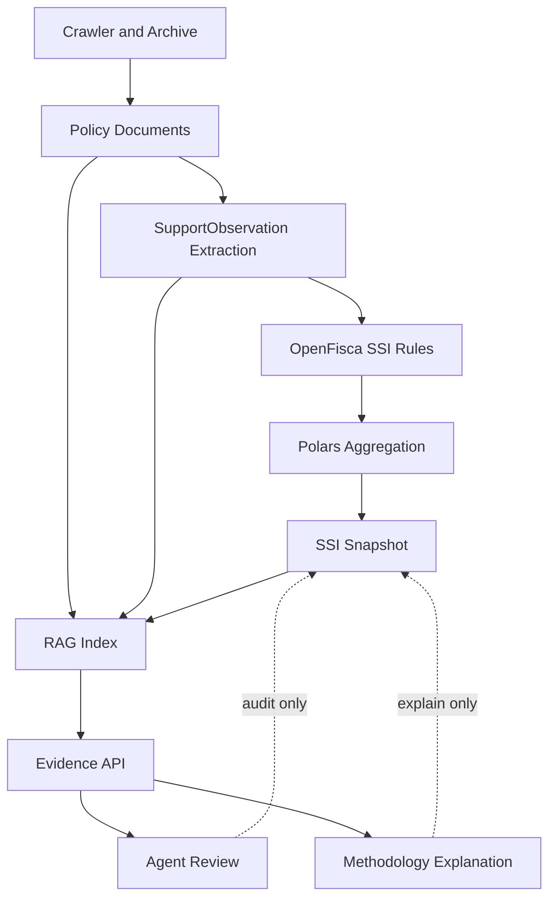

# 高价值附加设计文档

日期：2026-06-12

## 1. 设计结论

本项目后续应建设 RAG 系统，但 RAG 的定位必须是：

```text
政策证据检索层 + 审计追溯层 + Agent 审查上下文层
```

RAG 不得成为指数计算层。`State Support Intensity Index` 的金额、归一化、权重、双重计算和聚合仍由确定性代码完成：

```text
SupportObservation -> OpenFisca rules -> Polars aggregation -> DuckDB/export
```

RAG 只能回答证据相关问题，例如：

- 某个 SSI 数值背后有哪些政策原文和附件？
- 某条 `SupportObservation` 的金额来自哪段文本或表格？
- 某个渠道为什么是 `missing`？
- 某个行业在某一年有哪些财政补贴、税收优惠、土地政策和信贷政策？
- Agent 审查某个 snapshot 时应优先阅读哪些原文？

RAG 不能做：

- 直接生成 `observed_amount`。
- 替代 `normalization_base`。
- 把政策热度或政策语气转成补贴金额。
- 修改 OpenFisca / Polars 的计算结果。
- 在没有 source document 的情况下产生指数解释。

## 2. 推荐最佳架构

推荐组合：

```text
LlamaIndex 编排
+ Qdrant Hybrid Search
+ BGE-M3 embedding
+ BGE reranker
+ immutable ArchiveManifest
+ Docling/Tika document parsing
```

选择理由：

- LlamaIndex 的 `Document` / `Node` 抽象适合做政策文件、附件和 chunk metadata 管理。
- Qdrant 支持 dense、sparse、multi-vector 和 payload filter，适合中文政策的语义检索、关键词检索和结构化过滤。
- BGE-M3 同时支持多语言、多粒度、dense/sparse/multi-vector，适合中文政策和 OECD/IMF/WTO 等英文 benchmark 混合语料。
- BGE reranker 可对 top-k 检索结果做二次精排，提高证据片段准确性。
- Docling 适合本地解析 PDF、Word、表格和 OCR；Apache Tika 可作为多格式解析兜底。

参考来源：

- [LlamaIndex RAG](https://developers.llamaindex.ai/python/framework/understanding/rag/)
- [Qdrant Hybrid Queries](https://qdrant.tech/documentation/search/hybrid-queries/)
- [Qdrant Indexing](https://qdrant.tech/documentation/manage-data/indexing/)
- [BGE-M3](https://bge-model.com/bge/bge_m3.html)
- [BGE Reranker](https://bge-model.com/tutorial/5_Reranking/5.2.html)
- [Docling](https://www.docling.ai/)
- [Apache Tika](https://tika.apache.org/)
- [Ragas Faithfulness](https://docs.ragas.io/en/latest/concepts/metrics/available_metrics/faithfulness/)
- [LlamaIndex Evaluation](https://developers.llamaindex.ai/python/framework/module_guides/evaluating/)

## 3. 系统边界

### 3.1 RAG 的输入

RAG 只读取本项目已归档内容：

```text
workspace/raw/
workspace/text/
workspace/documents/
workspace/attachments/
workspace/observations/
workspace/index/
exports/latest/
```

RAG 不直接访问 `/Users/alex/Documents/金融项目`，也不写入其他项目。

### 3.2 RAG 的输出

RAG 输出必须是证据包，而不是计算值：

```text
retrieved_chunks
source_document_ids
quote_spans
raw_path
text_path
attachment_paths
confidence_notes
missing_evidence_notes
```

### 3.3 RAG 与计算引擎的关系



Agent 和 RAG 对 snapshot 只能产生 warning、finding、explanation 或 missing-data note，不能直接改数值。

## 4. 不可变归档前置

RAG 的事实源必须是不可变归档，而不是当前网页或临时解析结果。

建议新增目录：

```text
workspace/archive/runs/
workspace/archive/manifests/
workspace/archive/versions/
workspace/chunks/
workspace/rag/
```

### 4.1 ArchiveManifest

每个归档文档版本需要一条 manifest：

```json
{
  "crawl_run_id": "run_20260612_001",
  "document_id": "mof_policy_xxx",
  "document_version_id": "mof_policy_xxx_v001",
  "source_id": "mof_policy",
  "url": "https://www.mof.gov.cn/...",
  "canonical_url": "https://www.mof.gov.cn/...",
  "title": "关于下达专项资金的通知",
  "issuer": ["财政部"],
  "doc_number": "财建〔2026〕1号",
  "published_at": "2026-06-01",
  "retrieved_at": "2026-06-12T10:00:00Z",
  "raw_path": "workspace/raw/mof_policy/xxx.html",
  "text_path": "workspace/text/xxx.txt",
  "attachment_paths": [],
  "content_hash": "sha256:...",
  "url_hash": "sha256:...",
  "parser_version": "doc_parser_v1",
  "parse_status": "parsed",
  "previous_version_id": null
}
```

规则：

- 同 URL 内容变化时新增 `document_version_id`，不覆盖旧版本。
- 同 content hash 的重复文档只增加 source mapping，不复制正文。
- 所有 attachment 必须归档原件。
- 解析失败也要保留 raw 和 manifest，并标记 `parser_failed`。

## 5. 文档解析层

### 5.1 HTML

继续使用 BeautifulSoup，但必须新增站点专用 parser：

- `gov_cn_policy_parser`
- `ndrc_policy_parser`
- `miit_policy_parser`
- `mof_policy_parser`
- `chinatax_rules_parser`
- `pbc_rules_parser`
- `landchina_parser`

通用 parser 只做兜底。

### 5.2 PDF / Word / Excel / OFD

推荐策略：

```text
Docling primary parser
Apache Tika fallback parser
manual_review_required for failed files
```

解析输出：

```text
plain_text
markdown
tables_json
page_map
ocr_status
parser_warnings
```

表格必须单独存储，因为财政预算、土地成交、税收优惠和基金出资信息经常在附件表格里。

## 6. Chunk Schema

政策文件不能只按固定 token 粗切。建议采用层级 chunk：

```text
document
  section chunk
  article chunk
  paragraph chunk
  table chunk
  attachment chunk
```

每个 chunk：

```json
{
  "chunk_id": "chunk_xxx",
  "document_id": "mof_policy_xxx",
  "document_version_id": "mof_policy_xxx_v001",
  "source_id": "mof_policy",
  "url": "https://www.mof.gov.cn/...",
  "title": "关于下达专项资金的通知",
  "issuer": ["财政部"],
  "published_at": "2026-06-01",
  "retrieved_at": "2026-06-12T10:00:00Z",
  "chunk_type": "paragraph",
  "section_title": "支持范围",
  "page_number": null,
  "attachment_id": null,
  "text": "中央财政下达专项资金5亿元...",
  "text_hash": "sha256:...",
  "content_hash": "sha256:...",
  "parser_version": "doc_parser_v1",
  "rag_index_version": "rag_v1",
  "channel_candidates": ["direct_subsidy"],
  "industry_candidates": ["semiconductor"],
  "amount_candidates": [
    {
      "raw_value": "5亿元",
      "amount_rmb": 500000000,
      "context": "中央财政下达专项资金5亿元..."
    }
  ]
}
```

## 7. Qdrant Collection 设计

建议 collection：

```text
china_policy_chunks
```

向量：

```text
dense: BGE-M3 dense vector
sparse: BGE-M3 sparse vector
multi_vector: optional late-interaction vector, V2 再启用
```

Payload index 字段：

```text
document_id
document_version_id
source_id
issuer
published_at
period
channel_candidates
industry_candidates
chunk_type
attachment_id
parser_version
rag_index_version
content_hash
```

这些字段必须支持 filter，因为政策检索经常需要：

- 只看财政部。
- 只看 2024-2026。
- 只看 `direct_subsidy`。
- 只看 `semiconductor`。
- 只看附件表格。

## 8. 检索流程

### 8.1 Query Router

先判断问题类型：

```text
policy_evidence_search
observation_trace
missing_gap_explanation
methodology_review
similar_policy_search
benchmark_context
```

### 8.2 Hybrid Retrieval

流程：

```text
metadata filter
  -> dense retrieval
  -> sparse retrieval
  -> RRF fusion
  -> BGE reranker
  -> citation packaging
```

默认参数：

```text
dense_top_k = 50
sparse_top_k = 50
rrf_k = 60
rerank_top_k = 12
final_top_k = 8
```

### 8.3 Evidence Package

RAG API 不直接返回散乱文本，而返回证据包：

```json
{
  "query": "半导体直接财政补贴有哪些原文证据？",
  "filters": {
    "industry": "semiconductor",
    "channel": "direct_subsidy"
  },
  "results": [
    {
      "chunk_id": "chunk_xxx",
      "document_id": "mof_policy_xxx",
      "source_id": "mof_policy",
      "title": "关于下达专项资金的通知",
      "url": "https://www.mof.gov.cn/...",
      "published_at": "2026-06-01",
      "quote": "中央财政下达专项资金5亿元...",
      "raw_path": "workspace/raw/mof_policy/xxx.html",
      "text_path": "workspace/text/xxx.txt",
      "score": 0.91,
      "rerank_score": 0.86
    }
  ],
  "missing_notes": []
}
```

## 9. API 设计

建议新增 API：

```text
POST /api/rag/index/rebuild
GET  /api/rag/index/status
POST /api/rag/search
GET  /api/rag/document/{document_id}
GET  /api/rag/chunk/{chunk_id}
GET  /api/evidence/observation/{observation_id}
POST /api/evidence/agent-review-context
```

最重要的是：

```text
GET /api/evidence/observation/{observation_id}
```

它必须返回：

```text
observation
source documents
retrieved chunks
amount context
normalization base source
method version
double count group
gap status
```

## 10. Agent 集成

RAG 给 Camel-AI / CrewAI 的接口是 context provider，不是 tool executor。

Agent 使用 RAG 做：

- 证据完整性审查。
- 金额上下文审查。
- 双重计算风险审查。
- 缺口解释。
- methodology note 草稿。

Agent 输出仍走现有 `CamelReviewEnvelope`：

```json
{
  "agent_id": "evidence_qa_analyst",
  "task_id": "review_obs_xxx",
  "status": "completed",
  "findings": [],
  "recommended_actions": [],
  "blocked_by": [],
  "source_document_ids": [],
  "method_version": "ssi_v1",
  "affects_calculation": false
}
```

如果 Agent 发现证据不足，只能写 warning 或 gap note，不能自动补金额。

## 11. 评测体系

RAG 必须有独立验收测试。

### 11.1 Retrieval Metrics

使用：

- Hit Rate@k
- MRR
- Recall@k
- Precision@k
- NDCG

### 11.2 Answer Metrics

使用：

- Faithfulness
- Context Recall
- Context Precision
- Citation Coverage
- Unsupported Claim Rate

### 11.3 项目专用 Golden Set

至少建立这些问题：

```text
某个 observation 的金额来自哪份文件？
某个行业某年直接补贴有哪些政策证据？
某个渠道为什么是 missing？
R&D 税收优惠和 other tax incentive 是否重复？
某个 benchmark 与 SSI 口径有什么差异？
```

验收门槛建议：

```text
Hit Rate@10 >= 0.90
MRR@10 >= 0.70
Faithfulness >= 0.95
Unsupported Claim Rate <= 0.02
Citation Coverage = 1.00
```

## 12. 实施计划

### Phase R0：归档强化

交付：

- `ArchiveManifest` schema。
- crawl run manifest。
- URL/content hash 去重。
- 文档版本化。
- 附件归档路径。

验收：

- 同一 URL 内容变更不会覆盖旧版本。
- 每个 document 可回链到 raw、text、attachments、parser version。

### Phase R1：解析和 chunk

交付：

- HTML site-specific parser。
- Docling / Tika parser adapter。
- chunk schema。
- table chunk 存储。

验收：

- HTML/PDF/Excel/Word 至少一种 fixture 可生成 chunk。
- chunk 可回链到 document version 和原始文件。

### Phase R2：Qdrant hybrid index

交付：

- Qdrant collection。
- BGE-M3 dense/sparse embedding。
- payload indexes。
- index rebuild script。

验收：

- 支持 source、issuer、period、channel、industry filter。
- 支持 dense+sparse hybrid search。

### Phase R3：Rerank 和 Evidence API

交付：

- BGE reranker。
- `/api/rag/search`。
- `/api/evidence/observation/{observation_id}`。

验收：

- 每个 RAG answer 必须有 citation。
- observation evidence API 可返回金额上下文和原始路径。

### Phase R4：Agent 审查集成

交付：

- Agent review context builder。
- evidence QA prompt。
- methodology review prompt。

验收：

- Agent 输出 audit-only envelope。
- Agent 不能修改 SSI snapshot 数值。

### Phase R5：RAG eval

交付：

- golden question set。
- retrieval eval。
- faithfulness eval。
- CI smoke。

验收：

- 达到项目设定指标门槛。
- 检索失败时输出 warning，不静默生成解释。

## 13. 风险和控制

| 风险 | 控制 |
|---|---|
| RAG 幻觉金额 | RAG 禁止写 `observed_amount`，金额只来自 extraction / authorized data |
| 检索漏掉关键政策 | hybrid search + metadata filter + eval golden set |
| 中文政策词精确匹配失败 | BGE-M3 sparse + dense 双检索 |
| 附件表格丢失 | Docling/Tika parser + table chunk |
| 旧网页被覆盖 | immutable document version |
| Agent 越权修改计算 | `affects_calculation=false` schema gate |
| 证据无法追溯 | chunk 必须绑定 document/version/raw/text path |

## 14. Definition of Done

RAG 系统完成必须满足：

- 每个 chunk 都能回链到不可变归档。
- 每个 RAG answer 都有 citation。
- 每个 `SupportObservation` 都能通过 Evidence API 找到原文证据或 gap 说明。
- RAG 不产生最终 SSI 金额。
- RAG 不修改 OpenFisca / Polars 结果。
- RAG 检索通过 golden set 评测。
- 所有输出都在 `/Users/alex/Documents/china policy analyse` 内。

最终形态：

```text
归档是事实源
RAG 是证据大脑
OpenFisca 是计算器
Agent 是审计员
```
